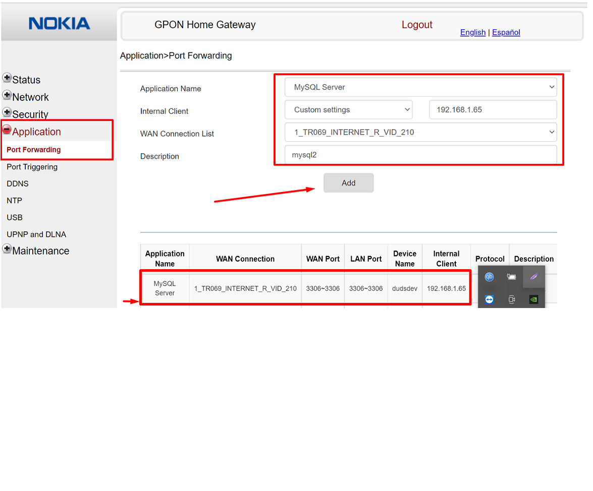
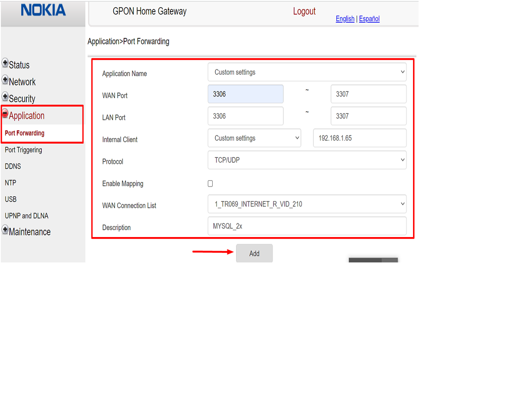

## Roteador(G140-W branco) - NOKIA

- Análise num router desses, pegueis algumas informações básicas :

Router Model/Name: Nokia G-140W-H
Chipset : BCM6846

---

> - Versão de Firmware: NÃO APARECE NO CLIENT DO ROUTER.

> - Versão de Hardware: NÃO APARECE NO CLIENT DO ROUTER.	

---

### Liberação de portas nesse roteador :

