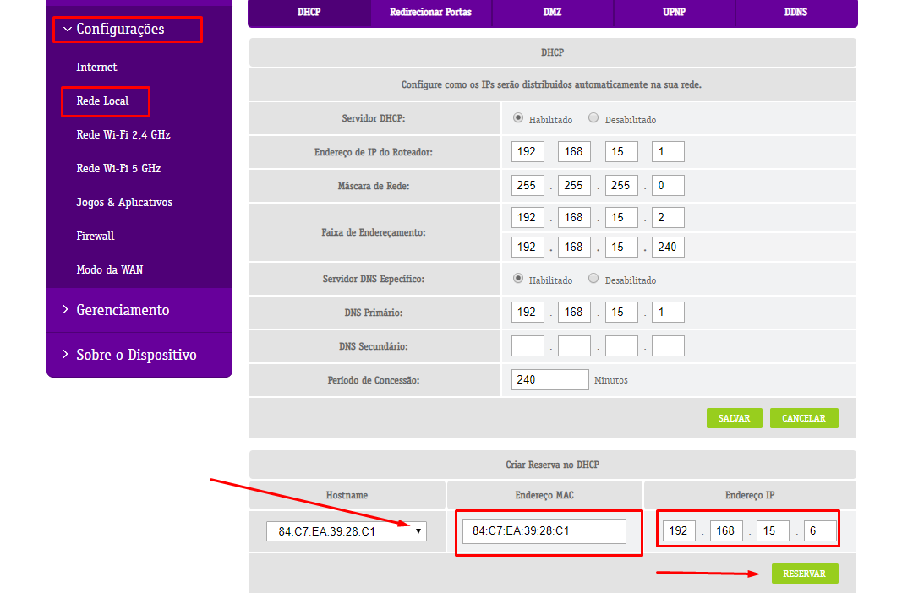
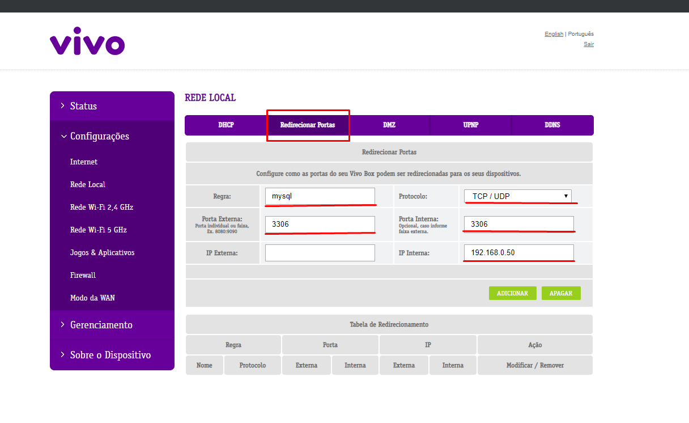

## Roteador(RTF3505VW-N2 preto) - Vivo

- Análise num router desses, pegueis algumas informações básicas :

Roteador : VIVO BOX
>Modelos possíveis :

	RTF3505VW-N2
	RTF8115VW

> Versões de Hardware que já vi:

	REV4_B4
	REV5

---

### Liberação de portas nesse roteador :

