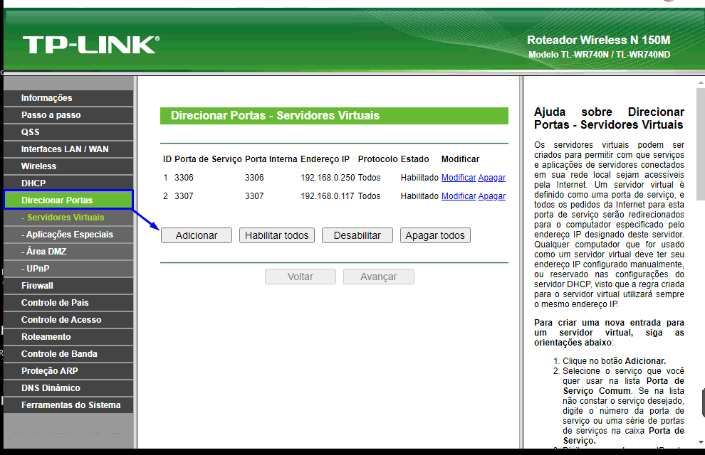
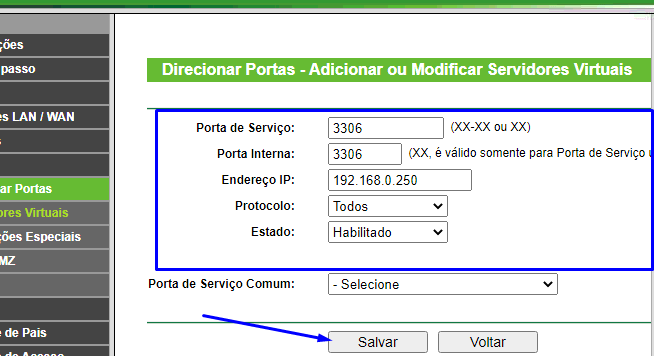

## Roteador(TL-WR740N / TL-WR740ND) - TPLink

- Análise num router desses, pegueis algumas informações básicas :

- Roteador Wireless N 150M Modelo TL-WR740N / TL-WR740ND

---

> - Versão de Firmware:	
3.16.6 Build 130606 Rel.47286n

> - Versão de Hardware:	
WR740N v4 00000000

---

### Liberação de portas nesse roteador :

