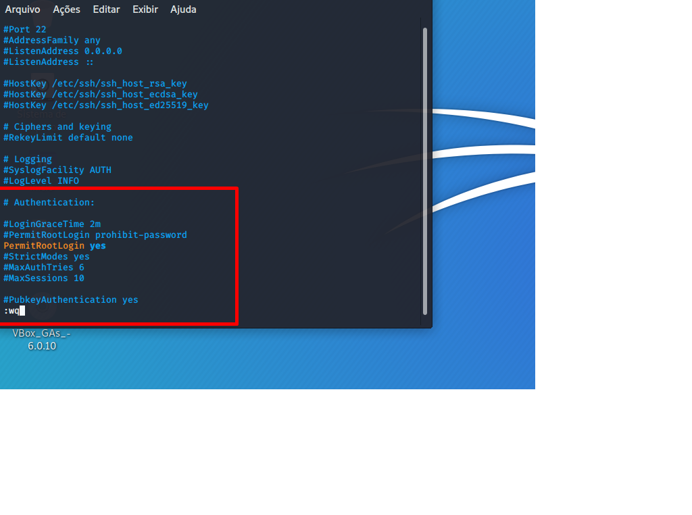

## Ativar o serviço de SSH no Kali Linux :

- via terminal, abrir o arquivo de configurações e depois rodar alguns comandos conforme o exempo :

		sudo nano /etc/ssh/sshd_config
	
		#PermitRootLogin yes
		PermitRootLogin yes

		sudo service ssh status

		sudo service ssh start

> Imagem para auxiliar no setup :

