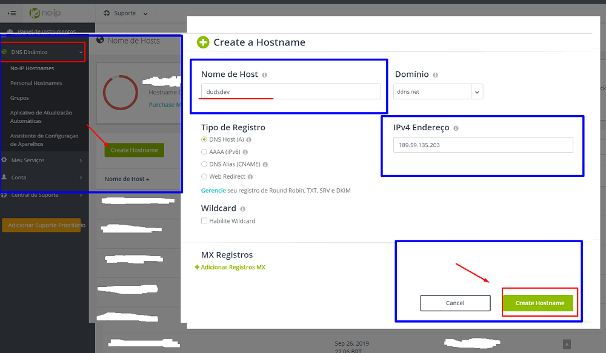

Passo a Passo SETUP DDNS
=========================

- Configuração de DDNS para o IP EXTERNO nos servidores de banco de dados.

1. Entrar no site do NoIP : https://www.noip.com/
2. Fazer o login, com as credenciais do NoIP.
3. Para criar um novo Host,seguimos o seguinte processo:

	Clicar em DNS Dinâmico
	Create hostname
	Informar nome do host
	Clicar no botão 'Create Hostname'

4. Fazer o download do software DucNoIP : 	https://www.noip.com/client/DUCSetup_v4_1_1.exe

5. Após o download, fazer a instalação de forma convencional.

6. Após instalação, fazer o login com o hostname criado anteriormente.

7. Agora faremos o seguinte Setup para escolher o Host:

		Clicar em Edit Hosts.
		Marcar o Host desejado.
		Marcar a flag 'Require a password to modify hosts'
		Clicar no botão 'Save'
		Setar a senha padrão, para acessar o DucNoIp na máquina = xxxx

8. Em seguida faremos um setup para inicialização automática do DucNoIP no Windows :

		Ir na aba 'File' > 'Preferences'
		Marcar as 2 primeiras flags

	
9. Liberar aa portas 3306/3307 no Firewall do Windows. ( Caso tenha um anti-vírus com Firewall, fazer a liberação nele também)

10. Liberar as portas 3306/3307 no equipamento de rede, de onde vai receber os acessos.(roteador,loadbalance...)